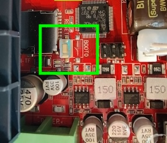

# How to Dump Neptune 4 MCU Firmware

**Warning:** Only flash this firmware on a DE-ELEGOO setup/image, **not** on stock Elegoo software.

## Steps:

1. **Solder a Momentary Button:**
   - Solder a momentary push button on the BOOT pads on the MKS/Elegoo control board next to the RESET button. This button is a common 6x3x4.3 mm SMD Tactile Push Button Switch. 
   - Alternatively, the riskier method is to bridge these with sharp metal tweezers when required (not advised due to ESD & potential for short circuit).
   - 
  
2. **Update Klipper etc in Kiauh:**
   ```
   ~/kiauh/kiauh.sh
   ```
   - Select Menu Option 2
   - Wait for kiauh to check for updates
   - Type the letter 'a' to select update all
   - Press ENTER to initiate updates
   - Exit out of kiauh
   
4. **Power On and Boot Process:**
   - Ensure the printer is on.
   - Simultaneously press and hold the BOOT button (or bridge the BOOT pads) and the RESET button.
   - First, let go of the RESET button and wait for about one second.
   - Then, release the BOOT button.

5. **SSH and Commands:**
   - Leave the printer on, and SSH in (as mks) and type:
     ```
     sudo service klipper stop
     stm32flash -r ~/firmware-bak.bin /dev/ttyS0
     ```
   - If this errors out, repeat the BOOT/RESET button-press then re-run the stm32flash command till it works.

6. **Copy Firmware Backup off the Machine (Optional):**
   - From another terminal on the computer, copy this off your printer using:
     ```
     scp mks@IPADDRESS:/home/mks/firmware-bak.bin .
     ```

7. **Shutdown:**
   - Type `sudo poweroff` (then power cycle after ~20s).

## How to Flash Updated Klipper MCU Firmware

(Only do this if you have removed Elegoo services and are running standard/updated releases of Klipper.)

1. **Enter Bootloader Mode:**
   - Turn on the printer.
   - Simultaneously press and hold the BOOT button (or bridge the BOOT pads) and the RESET button.
   - First, let go of the RESET button and wait for about one second.
   - Then, release the BOOT button.

2. **SSH and Commands:**
   - Leave the printer on, and SSH in (as mks) and type:
     ```
     cd /home/mks/klipper/
     make clean
     make menuconfig
     ```
   - Enter the following configurations using arrow keys and SPACEBAR to select.
   - STMicroelectronics STM32 - STM32F401 - 32KiB Bootloader - and USART PA10/PA9 - settings.
   - Once you have selected the correct options hit the Q key and then Y to close and save.
   - Now run:

     ```
     make
     ```

4. **Flash Klipper Firmware:**
   - Repeat the BOOT and RESET process.
   - Then, type:
     ```
     sudo service klipper stop
     stm32flash -w /home/mks/klipper/out/klipper.bin -v -S 0x08008000 -g 0x08000000 /dev/ttyS0
     ```

5. **Shutdown:**
   - Type `sudo poweroff` (then power cycle after ~20s).

6. **If this doesn't work (usually if you flashed MCU firmware before):**
   - Repeat the BOOT and RESET process.
   - Then, flash the provided elegoo firmware with:
     ```
     sudo service klipper stop
     stm32flash -w /home/mks/OpenNept4une/mcu-firmware/firmware-bak.bin -v /dev/ttyS0
     ```
   - Type `sudo poweroff` (then power cycle after ~20s).
   - Going forward you may use the first (compile with make menuconfig) method to update your mcu to the latest version.
   ## How to Recover OG MCU Firmware

(Your previously backed-up Elegoo Firmware)

1. **Power On and Boot Process:**
   - Similar to the above steps.
   
2. **SSH and Commands:**
   - Leave the printer on, and SSH in (as mks) and type:
     ```
     sudo service klipper stop
     stm32flash -w ~/firmware-bak.bin -v /dev/ttyS0
     ```
   - If this fails, retry the BOOT & RESET button method above then re-run the stm32flash command till it works.
   - Type `sudo poweroff` (then power cycle after ~20s).

